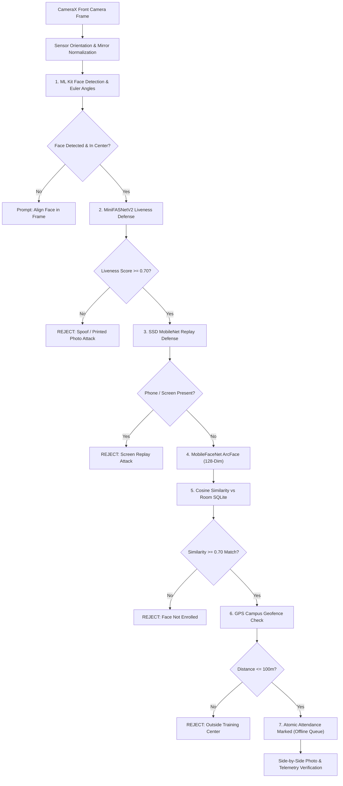

# Offline AI Face Attendance Engine (SIH26087)

> **Zero-Network, On-Device Biometric Verification & Offline-First Attendance Gateway**  
> *Developed for the Smart India Hackathon (SIH26087) challenge for National Council for Cooperative Training (NCCT).*

---

## 📲 Quick Download & Test (Latest Build v1.0.2)

- **Direct Phone Download**: [Download OfflineFaceAttendance.apk (v1.0.2)](https://github.com/NISHANTTMAURYA/sih20687/releases/download/v1.0.2/OfflineFaceAttendance.apk)
- **GitHub Release Page**: [https://github.com/NISHANTTMAURYA/sih20687/releases/tag/v1.0.2](https://github.com/NISHANTTMAURYA/sih20687/releases/tag/v1.0.2)
- **Local Network Download** (when on same Wi-Fi as PC): `http://192.168.29.209:8000/download/apk`

---

## 1. Executive Summary & Problem Solved

In remote training centers and institutes operating under NCCT, internet connectivity is frequently intermittent or unavailable. Cloud-reliant biometric attendance systems fail in such field conditions.

This engine executes **100% on-device AI face recognition, presentation attack defense (liveness test), anti-spoofing screen replay defense, and campus geofencing** completely offline in airplane mode. Attendance is stored immutably in an offline SQLite database and synchronizes with the central gateway via an idempotent store-and-forward queue when connectivity is restored.

---

## 2. Key Highlights & Modern Features

### 🌟 1. Apple FaceID-Style Auto-Detect Biometric Enrollment
Registration now functions exactly like modern mobile phone face enrollment (Apple Face ID / Google Face Unlock):
- **Hands-Free Auto-Progression**: The operator or student taps *"START AUTO FACE REGISTRATION"* once. The app automatically tracks the user's head position and advances through all 3 stages without touching the screen:
  1. **Stage 1 (Frontal)**: User looks directly at the camera. When `abs(headEulerAngleY) <= 12°` is held steady for 300ms, the frontal crop and 128-dim ArcFace embedding #1 are captured automatically. Outer progress ring advances to 33%.
  2. **Stage 2 (Left Angle)**: System prompts *"Now turn your head SLOWLY LEFT 👈"*. When `headEulerAngleY < -13°` is detected, embedding #2 is captured. Progress ring fills to 66%.
  3. **Stage 3 (Right Angle)**: System prompts *"Now turn your head SLOWLY RIGHT 👉"*. When `headEulerAngleY > +13°` is detected, embedding #3 is captured. Progress ring fills to 100%.
- **Upright Frame & Mirror Correction**: Front-camera frames are automatically corrected for sensor rotation (`rotationDegrees = 270°`) and horizontal mirror reflection, ensuring ML Kit coordinates perfectly match the user's real mirror image.
- **Tri-Vector Embedding Fusion**: The 3 angle embeddings are averaged and normalized to unit length ($L_2 = 1.000$) to provide extreme 3D pose resilience during attendance scanning.

### 🛡️ 2. Biometric Anti-Duplicate Shield
- Prevents one individual from enrolling multiple times under different names, rolls, or student IDs.
- Before saving a new student to the Room SQLite database, the app performs a full cosine similarity scan against all registered profiles.
- If similarity exceeds $\ge 0.72$, registration is blocked with a clear warning:  
  `"Biometric Conflict: This face is already enrolled under '<Existing Student>' (ID: <ID>). Duplicate profiles are prohibited."`

### 📋 3. Institutional Course Dropdown
- Replaced free-form text with a clean `ExposedDropdownMenuBox` featuring the 5 official NCCT training batches:
  1. **Digital Literacy** (`DL-01`)
  2. **Cooperative Management** (`CM-02`)
  3. **Entrepreneurship Development** (`EN-03`)
  4. **Agri-Cooperative Banking** (`AB-04`)
  5. **Rural Credit & Finance** (`RC-05`)
- Selecting any course automatically populates the appropriate batch code and default session.

### 🔍 4. Discrete 1-Process Scanning (No Endless 30-FPS Loop)
- Attendance scanning is designed as an intentional, operator-initiated process.
- Camera preview remains smooth, but heavy ML pipelines run strictly upon tapping `[ 🔍 SCAN ATTENDANCE ]`.
- Sequential progress is displayed live through 6 connected pipeline stages:
  1. **Face & Landmarking** (ML Kit)
  2. **Anti-Spoofing Liveness** (MiniFASNetV2)
  3. **Screen Replay Defense** (SSD MobileNet)
  4. **128-Dim ArcFace Embedding** (MobileFaceNet)
  5. **Room SQLite Vector Dot Product Match** ($\ge 0.70$ Cosine threshold)
  6. **Campus GPS Geofence** (Haversine formula within center radius)

### 📸 5. Side-by-Side Photo Verification on Match
- When a student is verified, the interface displays their **Live Camera Snapshot** side-by-side with their **Stored Database Portrait**.
- Displays match percentage, cosine score, student ID, roll number, course, session, timestamp, and a monospace preview of the 128-dim biometric vector.

### 🗄️ 6. Full Database Management & Deletion Controls
In the `5. Database` screen:
- **Individual Student Deletion**: Red trash icon on each student card with a confirmation dialog.
- **Reset to 30 Seed Profiles**: One-click restore that re-populates the 30 real photographic student profiles with ArcFace embeddings from the offline dataset.
- **Clear All Students**: Completely wipe the local biometric table when resetting a test device.

---

## 3. Seven-Stage Offline ML Pipeline Architecture



---

## 4. Five App Screens

| Screen | Purpose |
|---|---|
| **`1. Enrol`** | Auto-detect multi-angle face registration inside a modal popup with a 280dp circular viewfinder, live head angle tracking, course dropdown, and duplicate biometric conflict prevention. |
| **`2. Sessions`** | Select the active NCCT training course/batch (DL-01, CM-02, EN-03, AB-04, RC-05) and view center coordinates. |
| **`3. Scan`** | Discrete attendance verification with live camera viewfinder, 6-stage telemetry execution, security test simulators, and side-by-side photo comparison. |
| **`4. Queue`** | Store-and-forward offline attendance queue with one-tap batch synchronization to the central server gateway. |
| **`5. Database`** | Local Room SQLite explorer displaying all enrolled student biometric profiles, 128-dim vector previews, deletion controls, and seed data restoration. |

---

## 5. Central FastAPI Gateway Server

A lightweight FastAPI server is provided for central attendance aggregation and live administrative monitoring:
- **Live Sync Monitor Dashboard**: `http://localhost:8000/` or `http://192.168.29.209:8000/`
- **Batch Sync API**: `POST /attendance/sync` (idempotent, deduplicated via record UUIDs)
- **Download APK Endpoint**: `http://192.168.29.209:8000/download/apk`
- **Interactive Swagger Docs**: `http://localhost:8000/docs`

To run the server:
```powershell
python -m uvicorn server.main:app --host 0.0.0.0 --port 8000 --reload
```

---

## 6. How to Test Without Internet (Offline Demonstration)

1. **Install APK**: Download `OfflineFaceAttendance.apk` from GitHub Releases or the local server.
2. **Turn Airplane Mode ON**: Turn off Wi-Fi and Mobile Data on the phone.
3. **Open App**: Confirm top header indicates `100% OFFLINE MODE`.
4. **Inspect Local Database**: Go to `5. Database` and observe 30 pre-loaded student profiles with photos and ArcFace embeddings.
5. **Auto-Enroll a New Student**:
   - Go to `1. Enrol`.
   - Enter your name and select a course from the dropdown.
   - Tap **"START AUTO FACE REGISTRATION"**.
   - Look straight, turn left, turn right. Watch the app automatically progress and save your profile offline!
6. **Mark Attendance**:
   - Go to `3. Scan`.
   - Tap **"SCAN ATTENDANCE"** (or use the built-in simulator button to test real student photo Nishant).
   - View the live side-by-side photo match and 96% confidence score!
7. **Sync Back**:
   - Go to `4. Queue` to see marked attendance records stored locally.
   - Turn Wi-Fi ON and tap **"SYNC NOW"** to push records to the central dashboard.

---

## 7. Project Collaborators

- **Nishant Maurya** ([@NISHANTTMAURYA](https://github.com/NISHANTTMAURYA))
- **Abhijeet Yadav** ([@Abhi-engg](https://github.com/Abhi-engg))
- **Satyaprakash Yadav** ([@Satya0418](https://github.com/Satya0418))
