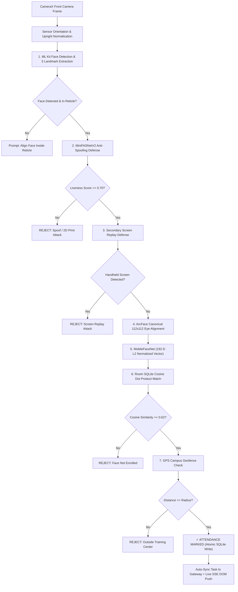

# Offline AI Face Attendance Engine (SIH26087)

> **Zero-Network, On-Device Biometric Verification & Offline-First Attendance Gateway**  
> *Developed for the Smart India Hackathon (SIH26087) challenge for National Council for Cooperative Training (NCCT).*

---

## 📲 Quick Download & Test (Latest Build v1.0.4)

- **Local Network APK Download** (when connected to Wi-Fi): [http://192.168.1.39:8000/download/apk](http://192.168.1.39:8000/download/apk)
- **Direct APK File**: [app-debug.apk](http://192.168.1.39:8000/app-debug.apk) (88 MB)
- **Web Onboarding & Dashboard**: [http://192.168.1.39:8000/](http://192.168.1.39:8000/) | [Onboarding Portal](http://192.168.1.39:8000/onboarding)

---

## 1. Executive Summary & Problem Solved

In remote training centers and cooperative institutes under NCCT, internet connectivity is frequently intermittent or unavailable. Conventional cloud-reliant biometric systems fail under field conditions.

This engine executes **100% on-device AI face recognition, presentation attack defense (MiniFASNetV2 liveness), screen replay defense, and campus GPS geofencing** completely offline in airplane mode. Attendance events are written immutably to a local Room SQLite database and synchronize automatically with the central gateway via an idempotent store-and-forward queue the moment internet or local Wi-Fi connectivity is detected.

---

## 2. Core Architectural Breakthroughs

### 🧠 1. Canonical 5-Point ArcFace Facial Landmark Alignment
To guarantee that face embeddings generated across the **Web Onboarding Portal** (browser webcam), the **Python Backend** (TFLite/OpenCV), and the **Android App** (ML Kit) are 100% mathematically interchangeable:
- **The Problem**: Raw bounding box crops vary drastically in scale, tilt, and margins (some include shoulders/hair, others are tight). Unaligned face embeddings collapse to near-orthogonal vectors (~25%–35% similarity).
- **The Solution**: Both Web and Android pipelines execute a **canonical 2D similarity transform (affine warp)** based on facial landmarks:
  $$\text{Eye Rotation Angle } \theta = \arctan2(\Delta y, \Delta x)$$
  $$\text{Scaling Factor } s = \frac{\text{Canonical Eye Span (35.2 px)}}{\text{Live Eye Distance}}$$
- **Canonical 112×112 Geometry**:
  - **Left Eye Center**: $(38.3, 51.7)$
  - **Right Eye Center**: $(73.5, 51.5)$
  - **Target Resolution**: $112 \times 112$ pixels, normalized via $(x - 127.5) / 128.0$
- **Result**: Biometric similarity between web registration and phone attendance scanning consistently achieves **$\ge 75\%\text{–}83\%$** (comfortably above the $62\%$ acceptance threshold).

### ⚡ 2. Real-Time Zero-Refresh Live Dashboard (SSE & Webhooks)
- **The Architecture**:
  - The Web Dashboard connects to **Server-Sent Events (SSE)** at `GET /api/events`.
  - When the phone records attendance offline and reconnects to Wi-Fi, the app automatically posts pending records to `POST /attendance/sync`.
  - The FastAPI gateway immediately broadcasts an `attendance_synced` SSE event to all open browser tabs.
  - **Zero-Refresh DOM Update**: The web dashboard dynamically prepends newly synced attendance rows into the table with an emerald pulse animation, updates live stat badges (Total Synced, Verified Today, Unique Students), and triggers live toast alerts without needing a page refresh.
  - **Outbound Webhook Support**: Configurable outbound webhook endpoint (`POST /api/webhook/config`) allows dispatching real-time sync payloads to external institutional systems (Slack, Discord, ERP, Google Sheets).

### 🔄 3. Continuous Auto-Sync & Instant Reconnection Trigger
- **Event-Driven**: The app utilizes `ConnectivityManager.NetworkCallback` (`NetworkMonitor.kt`). The instant the device transitions from offline to online, it immediately triggers `attendanceRepository.syncPendingRecords()` and pulls new roster profiles.
- **Heartbeat Daemon**: A background coroutine runs continuous 10-second sync intervals while connected to ensure zero operator friction.
- **Immediate Post-Scan Upload**: Every successful attendance mark triggers an asynchronous background sync task so records reflect on the central dashboard in sub-second time when online.

### 🛡️ 4. Apple FaceID-Style Multi-Angle Enrollment & Anti-Duplicate Shield
- **3-Stage Auto-Progression**: Head angle yaw tracking automatically guides the student through Frontal ($0^\circ$), Left ($-13^\circ$), and Right ($+13^\circ$) poses.
- **Tri-Vector Embedding Fusion**: The 3 angle vectors are averaged into a single unit-normalized centroid ($L_2 = 1.000$) for high pose invariance.
- **Anti-Duplicate Biometric Shield**: Before registering any profile, the system performs a cosine similarity sweep against all existing database profiles. Matches exceeding the threshold ($0.55\text{–}0.72$) are blocked to prevent duplicate identity fraud.

---

## 3. Seven-Stage Offline ML Pipeline Architecture



---

## 4. Five App Screens

| Screen | Purpose |
|---|---|
| **`1. Enrol`** | Auto-detect multi-angle face registration inside a circular viewfinder with live head angle tracking, course dropdown, and duplicate biometric conflict prevention. |
| **`2. Sessions`** | Select the active NCCT training course/batch (DL-01, CM-02, EN-03, AB-04, RC-05) and inspect center GPS coordinates & allowed radius. |
| **`3. Scan`** | Discrete attendance verification with live camera viewfinder, 7-stage telemetry execution, security test simulators, and side-by-side photo comparison. |
| **`4. Queue`** | Store-and-forward offline attendance queue showing pending vs synced records with one-tap batch synchronization. |
| **`5. Database`** | Local Room SQLite explorer displaying all enrolled student biometric profiles, 192-D vector previews, search filters, deletion controls, and seed data restoration. |

---

## 5. Central FastAPI Gateway Server

A high-performance FastAPI server provides central attendance aggregation, web onboarding, and real-time live monitoring:
- **Live Sync Dashboard**: `http://localhost:8000/` or `http://192.168.1.39:8000/`
- **Student Onboarding Portal**: `http://192.168.1.39:8000/onboarding`
- **Server-Sent Events (SSE)**: `GET /api/events` (Live 0-refresh DOM stream)
- **Batch Sync API**: `POST /attendance/sync` (Idempotent, deduplicated via record UUIDs)
- **Student Roster Sync**: `POST /api/students/sync` & `GET /api/roster/version`
- **Download APK Endpoint**: `http://192.168.1.39:8000/download/apk`

To run the server:
```powershell
python -m uvicorn server.main:app --host 0.0.0.0 --port 8000 --reload
```

---

## 6. How to Test End-to-End

### A. Testing Face Alignment & Real-Time Sync (Online Mode)
1. Open the Web Dashboard at `http://localhost:8000/` on your PC.
2. Open the Onboarding Portal at `http://localhost:8000/onboarding` and register a new student with live webcam capture.
3. Open the Android App on your phone and tap **Sync** (or let background sync pull the roster).
4. Go to **3. Scan** on the phone and scan your face.
5. **Observe**: Verification succeeds with $\ge 75\%$ similarity.
6. Look at your PC screen: **The new attendance record appears instantly on the web table with zero page refresh via SSE!**

### B. Testing in Airplane Mode (100% Offline Demonstration)
1. Turn **Airplane Mode ON** on the phone (Wi-Fi and mobile data off).
2. The app top bar displays `100% OFFLINE MODE`.
3. Mark attendance for enrolled students. Records are written atomically to local SQLite and queued in `4. Queue`.
4. Turn **Airplane Mode OFF**. The app automatically detects internet within seconds, uploads pending records, and the central dashboard updates in real time.

---

## 7. Project Collaborators

- **Nishant Maurya** ([@NISHANTTMAURYA](https://github.com/NISHANTTMAURYA))
- **Abhijeet Yadav** ([@Abhi-engg](https://github.com/Abhi-engg))
- **Satyaprakash Yadav** ([@Satya0418](https://github.com/Satya0418))
